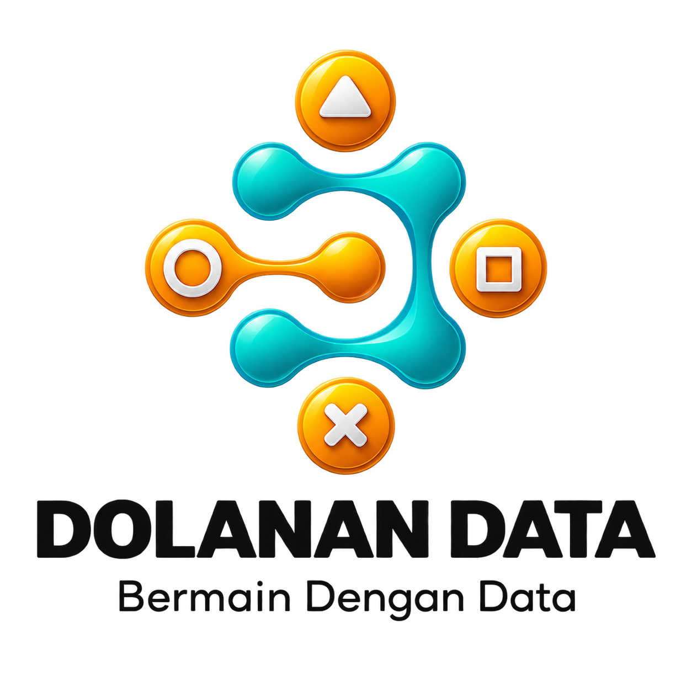

<div align="center">
  

  <h1>flood-segmentation-mask2former-nexus2026</h1>
  <p><strong>Multi-Class Flood Semantic Segmentation using Swin-Tiny Mask2Former</strong></p>

  <p align="center">
    
    
    
    
  </p>

  <p align="center">
    An end-to-end computer vision pipeline for multi-class flood semantic segmentation, integrating class-balanced sampling, Swin Transformer backbones, Lovasz-Softmax compound loss, and memory-optimized Test-Time Augmentation (TTA).
  </p>
</div>

## Tech Stack


## Overview

This repository contains the complete final solution developed by Team Dolanan Data for the Nexus 2026 Flood Segmentation Competition. The project addresses pixel-level scene parsing under extreme weather and flooding conditions, segmenting both standing infrastructure and flood dynamics across 10 semantic categories.

The pipeline spans raw image ingestion, exploratory spatial data analysis, custom category-balanced batch sampling, pre-trained Swin Transformer adaptation, Lovasz-Softmax boundary optimization, and memory-efficient TTA inference with Run-Length Encoding (RLE) submission export.

## Class Taxonomy

The target space comprises 10 mutually exclusive semantic categories:

| Class ID | Semantic Label | Category Group | Training Weight |
| :--- | :--- | :--- | :--- |
| 0 | `background` | Non-structural | 1.5 |
| 1 | `building flooded` | Rare Asset | 2.0 |
| 2 | `building non-flooded` | Standard Asset | 0.8 |
| 3 | `grass` | Vegetation | 0.8 |
| 4 | `pool` | Water Feature | 2.5 |
| 5 | `road flooded` | Transport Asset | 0.6 |
| 6 | `road non-flooded` | Transport Asset | 0.5 |
| 7 | `tree` | Rare Vegetation | 8.0 |
| 8 | `vehicle` | Rare Small Object | 8.0 |
| 9 | `water` | Primary Hazard | 2.0 |

## Pipeline Architecture and Methodology

The segmentation workflow is organized into six deterministic phases:

1. **Environment and Platform Detection**: Automatic platform resolution for Kaggle, Colab, or local environments, GPU capability inspection, and deterministic seed locking across NumPy, PyTorch, and Python runtimes.
2. **Exploratory Data Analysis and Validation**: Empirical pixel distribution calculation across 1,445 training images and 450 validation images, out-of-bounds pixel sanity checks, connected component analysis for small minority objects (vehicles), and Laplacian variance sharpness filtering.
3. **Augmentation and Balanced Sampling**: Heavy spatial and photometric transformations via Albumentations (CLAHE, RandomGamma, ShiftScaleRotate, GridDistortion, CoarseDropout) synchronized with a custom `BalancedBatchSampler` that guarantees the presence of rare classes and water features in every gradient update.
4. **Model Architecture and Loss Formulation**: Fine-tuning `facebook/mask2former-swin-tiny-ade-semantic` with Hugging Face AutoConfig. Training employs a compound loss combining weighted Negative Log-Likelihood (NLL) with Lovasz-Softmax:

$$
\mathcal{L}_{\text{total}} = (1 - w_{\text{lov}}) \mathcal{L}_{\text{NLL}} + w_{\text{lov}} \mathcal{L}_{\text{Lovasz}}
$$

5. **Optimization and Training Engine**: Parameter grouping with differential learning rates (`backbone: 1e-5`, `decoder: 5e-5`, `head: 1e-4`), polynomial decay scheduler with linear warmup, mixed precision (AMP), and Exponential Moving Average (EMA) weight smoothing.
6. **Inference and Submission Gate**: Test-Time Augmentation (TTA horizontal flip) optimized via `torch.einsum` on low-resolution logits to reduce peak VRAM usage by over 70%, dual prediction generation (`argmax` and calibrated per-class thresholds), format validation, and automated RLE encoding.

## Repository Structure

```
.
├── assets/
│   └── certificates/
│       ├── certificate-team.jpeg
│       ├── certificate-ababil-khoerul-imam.png
│       ├── certificate-ferliyana-ronnan.png
│       └── certificate-vierico-ventora.png
├── submissions/
│   └── submission-argmax.csv
├── .gitignore
├── dolanan-data-nexus-2026-final.ipynb
├── logo.png
├── notebook-context.md
├── requirements.txt
├── LICENSE
└── README.md
```

## Environment Setup

To install all dependencies required to execute the segmentation pipeline:

```bash
pip install -r requirements.txt
```

## Documentation

Detailed line-by-line lineage, input-output contracts, and validation evidence are documented in [notebook-context.md](notebook-context.md).

The primary notebook [dolanan-data-nexus-2026-final.ipynb](dolanan-data-nexus-2026-final.ipynb) contains 26 executable code cells paired with 26 managed Markdown lineage blocks.

## Team Dolanan Data

Nexus 2026 Finalists:

* Ababil Khoerul Imam ([Certificate](assets/certificates/certificate-ababil-khoerul-imam.png))
* Ferliyana Ronnan ([Certificate](assets/certificates/certificate-ferliyana-ronnan.png))
* Vierico Ventora ([Certificate](assets/certificates/certificate-vierico-ventora.png))
* Team Award ([Team Certificate](assets/certificates/certificate-team.jpeg))

## License

This project is licensed under the MIT License. See the [LICENSE](LICENSE) file for details.
