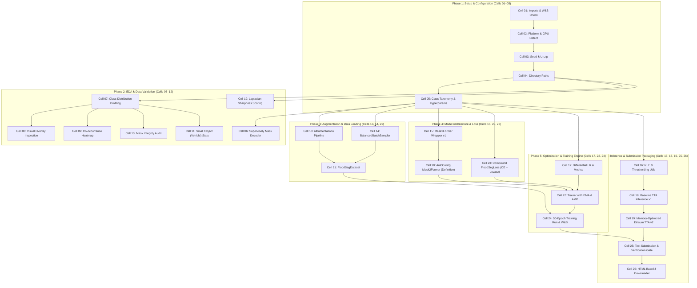

# Technical Documentation: `dolanan-data-nexus-2026-final.ipynb`

> **Analysis Mode:** Static Evidence Reconstruction (Read-Only). No notebook code was executed during this audit.  
> **Source SHA-256:** `9fe845aa5e499c9e47f6b7a266703c0c9034c37863df08bc205e83d71f554c76`  
> **Documented Primary Notebook:** `dolanan-data-nexus-2026-final.ipynb`

---

## 1. Project Overview & Operational Context

| Project Dimension | Observed Value / Technical Detail |
| :--- | :--- |
| **Objective** | Multi-class semantic segmentation on aerial/ground flood imagery to distinguish infrastructure, water bodies, vegetation, and flooded vs. non-flooded assets. |
| **Unit of Analysis** | $640 \times 480$ RGB images (`.jpg`) paired with 2D single-channel semantic label masks (`.png`). |
| **Target Taxonomy** | 10 mutually exclusive classes: `0: background`, `1: building flooded`, `2: building non-flooded`, `3: grass`, `4: pool`, `5: road flooded`, `6: road non-flooded`, `7: tree`, `8: vehicle`, `9: water`. |
| **Data Scope** | 1,445 training images/masks, 450 validation images/masks, and an unlabelled test set for competition submission. |
| **Primary Metric** | Mean Intersection over Union (mIoU) and Mean Dice Coefficient (F1-score). |
| **Model Architecture** | `facebook/mask2former-swin-tiny-ade-semantic` (Mask2Former with Swin Transformer Tiny backbone). |
| **Loss Formulation** | Compound Loss: $\mathcal{L}_{total} = 0.25 \cdot \mathcal{L}_{NLL} + 0.75 \cdot \mathcal{L}_{Lovasz}$. |
| **Hardware & Constraints** | Optimized for Kaggle Tesla T4 (16GB VRAM) using batch size 2, gradient accumulation over 4 steps, mixed precision (AMP), and Exponential Moving Average (EMA). |
| **Execution State** | Pipeline complete from ingestion to submission packaging. Cells 24–26 have `null` execution counts with historical output preserved. |

---

## 2. End-to-End Pipeline Architecture

---

## 3. Cell Lineage & Technical Contracts

### Phase 1: Environment Setup & Runtime Configuration

#### Cell 01: Core Library Imports & Monitoring Environment Check
- **Main Objective:** Import essential modules for deep learning, computer vision, data manipulation, and experiment logging.
- **Inputs:** Python runtime environment.
- **Method / Process:** Initializes standard library and third-party modules (`torch`, `transformers`, `albumentations`, `cv2`, `PIL`), checks for Weights & Biases (`wandb`) availability, defines recursive directory inspection utility `explore()`, and configures warning filters.
- **Outputs:** Global flag `WANDB_AVAILABLE`, utility function `explore()`.
- **Methodological Rationale:** Verifies prerequisite packages prior to compute-heavy operations and isolates W&B logging for offline/local execution.
- **Cross-Cell Dependencies:** Upstream: None; Downstream: Consumed by Cell 24 (Training execution).
- **Validation:** Protected import via `try-except` for `wandb`.
- **Evidence Status:** `SOURCE_OBSERVED` (Historical output logs: *"WANDB is available. All libraries successfully imported!"*).

---

#### Cell 02: Platform Detection & Dynamic Path Resolution
- **Main Objective:** Detect execution environment (Kaggle, Colab, or Local) and resolve GPU hardware capabilities.
- **Inputs:** `sys`, `os`, shell command `nvidia-smi`.
- **Method / Process:** Implements `find_kaggle_path()` using `os.walk` to dynamically search `/kaggle/input` for dataset and checkpoint folders. Queries GPU name via `os.popen('nvidia-smi...')`.
- **Outputs:** Boolean flags `IN_KAGGLE`, `IN_COLAB`, paths `KAGGLE_DATASET_PATH`, `KAGGLE_CKPT_INPUT`.
- **Methodological Rationale:** Prevents static path breakage across differing cloud container environments.
- **Cross-Cell Dependencies:** Upstream: Cell 01; Downstream: Cell 03, Cell 04.
- **Validation:** Case-insensitive directory matching and path existence verification.
- **Evidence Status:** `SOURCE_OBSERVED` (Historical output indicates Kaggle: True, GPU: Tesla T4).

---

#### Cell 03: Deterministic Seed Configuration & Dataset Extraction Check
- **Main Objective:** Enforce reproducible execution and extract zipped datasets if necessary.
- **Inputs:** `random`, `numpy`, `torch`, `KAGGLE_DATASET_PATH`.
- **Method / Process:** Implements `set_seed(42)` across Python, NumPy, and PyTorch (CPU & CUDA). Checks for `.zip` archives and unpacks to `/kaggle/working/extracted_dataset` if present.
- **Outputs:** Function `set_seed()`, variable `EXTRACT_PATH`.
- **Methodological Rationale:** Eliminates stochastic variation across model weight initialization and batch sampling.
- **Cross-Cell Dependencies:** Upstream: Cell 02; Downstream: Cell 04, Cell 24.
- **Validation:** Conditional `os.path.exists()` check before executing `ZipFile.extractall()`.
- **Evidence Status:** `SOURCE_OBSERVED` (Historical output reports dataset already extracted as directory).

---

#### Cell 04: Dataset Directory Anchoring & Split Paths
- **Main Objective:** Anchor absolute filesystem paths for train, validation, and test image/mask directories.
- **Inputs:** Base dataset path `BASE_PATH = "/kaggle/input/datasets/viericoventora/flood-segmentation-nexus-final/dataset_640x480/dataset_640x480"`.
- **Method / Process:** Maps paths to `TRAIN_IMG`, `TRAIN_MASK`, `VAL_IMG`, `VAL_MASK`, and `TEST_IMG`.
- **Outputs:** Directory path constants `TRAIN_IMG`, `TRAIN_MASK`, `VAL_IMG`, `VAL_MASK`, `TEST_IMG`.
- **Methodological Rationale:** Centralizes path configuration for downstream data loaders and evaluators.
- **Cross-Cell Dependencies:** Upstream: Cell 02; Downstream: Cells 07, 08, 10, 11, 12, 21, 24, 25.
- **Validation:** Directory verification via `os.path.exists()`.
- **Evidence Status:** `SOURCE_OBSERVED`.

---

#### Cell 05: Class Taxonomy, Hyperparameters & Model Configuration
- **Main Objective:** Define the 10-class segmentation taxonomy, manual class weights, normalization parameters, and training hyperparameters.
- **Inputs:** PyTorch tensor operations.
- **Method / Process:**
  - Defines `CLASS_NAMES` (0: background to 9: water).
  - Identifies `RARE_CLASSES = {1, 4, 7, 8}` (*building flooded, pool, tree, vehicle*).
  - Sets manual `CLASS_WEIGHTS` `[1.5, 2.0, 0.8, 0.8, 2.5, 0.6, 0.5, 8.0, 8.0, 2.0]`.
  - Configures `TRAIN_CONFIG` (`num_epochs=50`, `lr_backbone=1e-5`, `lr_head=1e-4`, `batch_size=2`, `accumulation_steps=4`, `lovasz_weight=0.75`, `poly_power=0.9`, `warmup_steps=125`).
  - Defines `resolve_ckpt()` function.
- **Outputs:** Constants `CLASS_NAMES`, `NUM_CLASSES`, `RARE_CLASSES`, `CLASS_WEIGHTS`, `MEAN`, `STD`, `MODEL_NAME`, `TRAIN_CONFIG`, `CKPT_M2F`.
- **Methodological Rationale:** Mitigates extreme class imbalance via elevated loss weights (8.0 for tree/vehicle) and establishes differential learning rates for transfer learning.
- **Cross-Cell Dependencies:** Upstream: Cell 02; Downstream: Cells 06, 07, 08, 13, 14, 15, 17, 20, 21, 22, 23, 24, 25.
- **Validation:** Automatic directory creation `os.makedirs(TRAIN_CONFIG['save_dir'], exist_ok=True)`.
- **Evidence Status:** `SOURCE_OBSERVED`.

---

### Phase 2: Exploratory Data Analysis & Annotation Validation

#### Cell 06: Supervisely Bitmap & Polygon Mask Decoding Utilities
- **Main Objective:** Provide backward-compatible utilities to decode zlib/base64 PNG bitmap masks and JSON annotations into 2D numpy arrays.
- **Inputs:** `CLASS_NAMES`, JSON annotation strings.
- **Method / Process:** Implements `decode_bitmap()` (base64 decode into BytesIO image) and `json_to_mask()` (rasterizes geometry and bitmap objects onto a blank mask).
- **Outputs:** Helper functions `decode_bitmap()`, `json_to_mask()`.
- **Methodological Rationale:** Ensures ingestion compatibility if annotations are supplied in raw vector/JSON schema.
- **Cross-Cell Dependencies:** Upstream: Cell 05; Downstream: Inferred utility module.
- **Validation:** Bounding box clamping using `min()` against canvas bounds `(H, W)`.
- **Evidence Status:** `SOURCE_OBSERVED`.

---

#### Cell 07: Dataset Class Distribution & Imbalance Profiling
- **Main Objective:** Measure per-class pixel counts and empirical distribution across training (1,445 images) and validation (450 images) sets.
- **Inputs:** `TRAIN_IMG`, `TRAIN_MASK`, `VAL_IMG`, `VAL_MASK`, `CLASS_NAMES`, `NUM_CLASSES`.
- **Method / Process:** Scans all mask images with `compute_distribution()`, accumulates unique pixel counts with `Counter`, and constructs distribution DataFrames.
- **Outputs:** Identifiers `train_ids`, `val_ids_all`, DataFrames `train_dist_df`, `val_dist_df`.
- **Methodological Rationale:** Quantifies foreground/background imbalance to validate loss weighting and balanced sampling strategies.
- **Cross-Cell Dependencies:** Upstream: Cell 04, Cell 05; Downstream: Cells 08, 09, 10, 11, 12, 24.
- **Validation:** Full iteration across 1,895 dataset mask files.
- **Evidence Status:** `SAVED_OUTPUT` (Historical output reports pixel breakdown per class).

---

#### Cell 08: Multi-Class Visual Inspection & Palette Overlay
- **Main Objective:** Render visual overlays of raw RGB images and ground-truth segmentation masks with class legends.
- **Inputs:** `TRAIN_IMG`, `TRAIN_MASK`, `CLASS_NAMES`, `train_ids`.
- **Method / Process:** Maps distinct hex colors in `CLASS_COLORS`, implements `visualize_sample()` displaying Original Image, Raw Mask, and Blended Mask side-by-side using Matplotlib.
- **Outputs:** Function `visualize_sample()`, rendered multi-panel plots.
- **Methodological Rationale:** Direct visual confirmation of boundary alignment, label consistency, and class color mapping.
- **Cross-Cell Dependencies:** Upstream: Cells 04, 05, 07; Downstream: EDA inspection.
- **Validation:** Renders 3 random sample figures with active legend patches.
- **Evidence Status:** `SAVED_OUTPUT` (Historical figure outputs saved).

---

#### Cell 09: Class Co-Occurrence & Correlation Heatmap
- **Main Objective:** Analyze pairwise co-occurrence and correlation between semantic categories across training images.
- **Inputs:** `train_dist_df`.
- **Method / Process:** Binarizes class presence `(train_dist_df > 0).astype(int)`, computes Pearson correlation matrix `binary_df.corr()`, and plots a Seaborn heatmap.
- **Outputs:** DataFrames `binary_df`, `corr_matrix`, correlation heatmap figure.
- **Methodological Rationale:** Reveals natural contextual dependencies (e.g., flooded roads co-occurring with water).
- **Cross-Cell Dependencies:** Upstream: Cell 07; Downstream: EDA analysis.
- **Validation:** 10x10 correlation matrix computation.
- **Evidence Status:** `SAVED_OUTPUT` (Historical heatmap output saved).

---

#### Cell 10: Mask Integrity & Out-of-Bounds Pixel Audit
- **Main Objective:** Audit all training masks for out-of-bounds pixel values (outside legal range [0, 9]).
- **Inputs:** `TRAIN_MASK`, `NUM_CLASSES`, `train_ids`.
- **Method / Process:** Iterates through every training mask, checking `np.min` and `np.max` against `NUM_CLASSES`.
- **Outputs:** Counter `anomaly_counter`, list `anomalies`.
- **Methodological Rationale:** Prevents CUDA kernel panics and index-out-of-bounds errors during Cross-Entropy loss computation.
- **Cross-Cell Dependencies:** Upstream: Cells 04, 05, 07; Downstream: Pre-training quality gate.
- **Validation:** Comprehensive check of all 1,445 training masks.
- **Evidence Status:** `SAVED_OUTPUT` (Historical output confirmed: 0 anomalous images found).

---

#### Cell 11: Connected Component Analysis for Minority Objects (Vehicle)
- **Main Objective:** Measure spatial area distribution of connected components for small minority classes (Class 8: Vehicle).
- **Inputs:** `TRAIN_MASK`, `train_ids`.
- **Method / Process:** Isolates binary vehicle masks, executes `cv2.connectedComponentsWithStats`, and compiles pixel area statistics (mean, min, max).
- **Outputs:** Function `analyze_small_objects()`, list `vehicle_sizes`.
- **Methodological Rationale:** Informs input cropping and scaling resolutions to prevent tiny objects from disappearing during downsampling.
- **Cross-Cell Dependencies:** Upstream: Cells 04, 07; Downstream: Cell 13 (Augmentation design).
- **Validation:** Connected component size filtering (`size > 0`).
- **Evidence Status:** `SAVED_OUTPUT` (Historical output: Mean size 1234.8 px, Min 1 px, Max 6863 px).

---

#### Cell 12: Image Sharpness & Laplacian Variance Audit
- **Main Objective:** Quantify image sharpness and identify motion blur or out-of-focus samples in training images.
- **Inputs:** `TRAIN_IMG`, `train_ids`.
- **Method / Process:** Converts images to grayscale and computes the variance of the Laplacian operator: `cv2.Laplacian(img, cv2.CV_64F).var()`.
- **Outputs:** Function `compute_blurriness()`, list `blur_scores`.
- **Methodological Rationale:** Evaluates image fidelity and establishes baseline blur variance for augmentation tuning.
- **Cross-Cell Dependencies:** Upstream: Cells 04, 07; Downstream: EDA quality evaluation.
- **Validation:** Evaluates blur score across all training images.
- **Evidence Status:** `SAVED_OUTPUT` (Historical output: Mean score 1313.40, Min score 38.71).

---

### Phase 3: Data Augmentation & Balanced Sampling Pipeline

#### Cell 13: Albumentations Spatial & Photometric Augmentation Pipeline
- **Main Objective:** Construct synchronized data augmentation pipelines for training and validation image/mask pairs.
- **Inputs:** `MEAN`, `STD`.
- **Method / Process:**
  - `train_transform`: `A.Compose` featuring `RandomCrop(480, 640)`, `HorizontalFlip`, `ShiftScaleRotate`, `RandomRotate90`, `CLAHE`, `RandomBrightnessContrast`, `RandomGamma`, `HueSaturationValue`, `GaussNoise`, `GridDistortion`, `CoarseDropout`, `Normalize`, `ToTensorV2()`.
  - `val_transform`: `A.Compose` featuring `PadIfNeeded(480, 640)`, `Normalize`, `ToTensorV2()`.
- **Outputs:** Transform objects `train_transform`, `val_transform`.
- **Methodological Rationale:** Heavy domain-specific augmentation prevents overfitting on small datasets and simulates adverse weather/lighting conditions.
- **Cross-Cell Dependencies:** Upstream: Cell 05; Downstream: Cell 21, Cell 24.
- **Validation:** Dual-target synchronization (`image` and `mask`).
- **Evidence Status:** `SOURCE_OBSERVED`.

---

#### Cell 14: BalancedBatchSampler for Rare & Water Class Allocation
- **Main Objective:** Implement a custom batch sampler ensuring balanced representation of rare and water classes in every training batch.
- **Inputs:** PyTorch `torch.utils.data.BatchSampler`.
- **Method / Process:** Implements `BalancedBatchSampler(BatchSampler)` partitioning sample indices into `rare_pool`, `water_pool`, and `normal_pool`, sampling with ratios `rare_ratio=0.50` and `water_ratio=0.10`.
- **Outputs:** Class `BalancedBatchSampler`.
- **Methodological Rationale:** Prevents batch starvation where rare classes (*building flooded, pool, vehicle*) receive zero gradient updates in standard random batches.
- **Cross-Cell Dependencies:** Upstream: Cell 05; Downstream: Cell 24.
- **Validation:** Dynamic pool replenishment upon exhaustion.
- **Evidence Status:** `SOURCE_OBSERVED`.

---

#### Cell 21: FloodSegDataset PyTorch Implementation & Category Caching
- **Main Objective:** Implement the PyTorch `FloodSegDataset` class with category indexing for balanced batch sampling.
- **Inputs:** `torch.utils.data.Dataset`, `PIL.Image`, `cv2`.
- **Method / Process:**
  - Reads image (OpenCV BGR->RGB) and mask (2D PNG).
  - Applies Albumentations transforms.
  - Scans all masks during initialization to index `rare_indices`, `water_indices`, and `normal_indices`.
- **Outputs:** Class `FloodSegDataset`, methods `get_normal_indices()`, `get_rare_indices()`, `get_water_indices()`.
- **Methodological Rationale:** High-speed lazy loading and zero-overhead category queries for `BalancedBatchSampler`.
- **Cross-Cell Dependencies:** Upstream: Cells 05, 13; Downstream: Cell 24.
- **Validation:** Mask tensor casting to `torch.long` and existence checks on image paths.
- **Evidence Status:** `SOURCE_OBSERVED` (Historical output: *"[OK] Class FloodSegDataset berhasil didefinisikan!"*).

---

### Phase 4: Model Architecture & Loss Formulation

#### Cell 15: Mask2Former Flood Architecture Wrapper (Version 1)
- **Main Objective:** Define initial neural network wrapper `Mask2FormerFlood` for HuggingFace `Mask2FormerForUniversalSegmentation`.
- **Inputs:** `MODEL_NAME`, `NUM_CLASSES`, `torch.nn.functional`.
- **Method / Process:** Extracts query logits (`class_queries_logits` and `masks_queries_logits`), projects mask probabilities to per-pixel class maps via `torch.bmm`, and returns log-probabilities. Implements `load_m2f()`.
- **Outputs:** Class `Mask2FormerFlood` (v1), functions `init_model()`, `load_m2f()`.
- **Methodological Rationale:** Adapts query-based universal segmentation architecture to output conventional dense 2D semantic logits $[B, C, H, W]$.
- **Cross-Cell Dependencies:** Upstream: Cell 05; Downstream: Superseded by Cell 20.
- **Validation:** Checkpoint path verification in `load_m2f()`.
- **Evidence Status:** `SOURCE_OBSERVED` (*Superseded by Cell 20*).

---

#### Cell 20: AutoConfig Mask2Former Model Redefinition (Definitive)
- **Main Objective:** Formally redefine `Mask2FormerFlood` architecture using HuggingFace `AutoConfig` for seamless weight loading.
- **Inputs:** `AutoConfig`, `Mask2FormerForUniversalSegmentation`, `MODEL_NAME`, `NUM_CLASSES`.
- **Method / Process:** Loads pre-trained configuration, updates `num_labels` to 10, sets `id2label`, overrides forward pass to compute log-probabilities with clamp guard `torch.log(seg_maps.clamp(min=1e-6))`.
- **Outputs:** Definitive class `Mask2FormerFlood` (v2), function `init_model()`.
- **Methodological Rationale:** Ensures exact parameter mapping with pre-trained Swin-Tiny ADE semantic weights while guaranteeing numerically stable log-probabilities.
- **Cross-Cell Dependencies:** Upstream: Cell 05; Downstream: Cells 22, 24, 25.
- **Validation:** `ignore_mismatched_sizes=True` parameter on pre-trained weight initialization.
- **Evidence Status:** `SOURCE_OBSERVED` (Historical output: *"[OK] Mask2FormerFlood redefined"*).

---

#### Cell 23: Compound Loss Function (Weighted NLLLoss + Lovasz-Softmax)
- **Main Objective:** Define compound loss `FloodSegLoss` optimizing both per-pixel classification accuracy and boundary IoU.
- **Inputs:** `torch.nn.NLLLoss`, Lovasz gradient functions `lovasz_grad()`, `lovasz_softmax_loss()`.
- **Method / Process:**
  - Interpolates log-probabilities to target spatial resolution $(H, W)$.
  - Calculates weighted `NLLLoss`.
  - Calculates multi-class Lovasz-Softmax loss on foreground/valid classes.
  - Combines losses: $\mathcal{L} = (1 - 0.75) \cdot \mathcal{L}_{CE} + 0.75 \cdot \mathcal{L}_{Lovasz}$.
- **Outputs:** Class `FloodSegLoss`, functions `lovasz_grad()`, `lovasz_softmax_loss()`.
- **Methodological Rationale:** Directly optimizes the non-differentiable Jaccard/mIoU target metric while maintaining stable pixel convergence.
- **Cross-Cell Dependencies:** Upstream: Cell 05; Downstream: Cells 22, 24.
- **Validation:** Ignores empty/unrepresented classes dynamically per batch.
- **Evidence Status:** `SOURCE_OBSERVED`.

---

### Phase 5: Optimization, Evaluation Metrics & Training Engine

#### Cell 17: Differential LR Optimizer & Semantic Segmentation Metrics
- **Main Objective:** Define semantic segmentation tracking metrics (`mIoU`, `Dice`) and differential learning rate optimizer with polynomial decay scheduler.
- **Inputs:** `torch.optim.AdamW`, `CLASS_NAMES`.
- **Method / Process:**
  - `FloodSegMetrics`: Accumulates global confusion matrix $[K, K]$, computes per-class IoU, Dice, and mean IoU.
  - `configure_optimizer()`: Partitions parameters into differential groups: `backbone` ($1e-5$), `decoder` ($5e-5$), and `head` ($1e-4$) with `weight_decay=0.05`.
  - `get_poly_scheduler()`: Linear warmup followed by polynomial decay: $(1 - \text{step}/\text{total})^{0.9}$.
- **Outputs:** Class `FloodSegMetrics`, functions `configure_optimizer()`, `get_poly_scheduler()`.
- **Methodological Rationale:** Preserves pre-trained Swin Transformer representations while aggressively training the decoder/segmentation queries.
- **Cross-Cell Dependencies:** Upstream: Cell 05; Downstream: Cell 22, Cell 24.
- **Validation:** Synthetic metric evaluation on random dummy arrays at definition time.
- **Evidence Status:** `SOURCE_OBSERVED`.

---

#### Cell 22: Exponential Moving Average (EMA) & Training Engine (Trainer)
- **Main Objective:** Implement training engine orchestrating epochs, mixed precision (AMP), gradient accumulation, clipping, and EMA weight tracking.
- **Inputs:** `torch.cuda.amp.GradScaler`, `torch.cuda.amp.autocast`, `copy.deepcopy`.
- **Method / Process:**
  - `EMA`: Exponential moving average ($\text{decay}=0.999$) maintained across training steps.
  - `Trainer`:
    - `_train_epoch`: Autocast forward pass, loss backpropagation, gradient accumulation (4 steps), `clip_grad_norm_` (1.0), EMA update.
    - `_val_epoch`: Dual evaluation (regular model & EMA model), mIoU tracking via `FloodSegMetrics`.
    - `_save_checkpoint`: Saves `best_mask2former.pth` on validation mIoU improvement.
- **Outputs:** Classes `EMA`, `Trainer`.
- **Methodological Rationale:** EMA produces smoother decision boundaries and higher validation generalization; AMP reduces VRAM footprint.
- **Cross-Cell Dependencies:** Upstream: Cells 05, 17, 20, 23; Downstream: Cell 24.
- **Validation:** Independent validation mIoU tracking and early stopping patience mechanism.
- **Evidence Status:** `SOURCE_OBSERVED`.

---

#### Cell 24: End-to-End Training Execution & W&B Tracking
- **Main Objective:** Instantiate data loaders, initialize model and loss, link W&B run tracker, and execute 50-epoch training.
- **Inputs:** All upstream components (Cells 01 through 23).
- **Method / Process:**
  - Partitions validation IDs into tuning (350) and early-stopping (100) sets.
  - Builds `FloodSegDataset` and `BalancedBatchSampler`.
  - Instantiates `Mask2FormerFlood`, `FloodSegLoss`, optimizer, scheduler, and `Trainer`.
  - Initializes `wandb.init(project="flood-segmentation-nexus-final")`.
  - Runs `trainer.train(num_epochs=50)`.
- **Outputs:** Checkpoint `best_mask2former.pth`, training metric history `history`.
- **Methodological Rationale:** Integrates full training pipeline and persists best checkpoint weights based on validation mIoU.
- **Cross-Cell Dependencies:** Upstream: Cells 01-23; Downstream: Cell 25.
- **Validation:** Automatic checkpoint resumption check if previous weights exist.
- **Evidence Status:** `SAVED_OUTPUT` (*Historical training output saved; uncommitted execution count*).

---

### Phase 6: Test Inference & Submission Generation

#### Cell 16: RLE Encoding & Per-Class Thresholding Utilities
- **Main Objective:** Provide Run-Length Encoding (RLE) compressors and margin-based thresholding inference post-processors.
- **Inputs:** `NUM_CLASSES`, `EMPTY_CLASSES`.
- **Method / Process:**
  - `rle_encode()`: Encodes 1D binary masks into space-separated `start length` run pairs.
  - `mask_to_rle()`: Generates RLE strings per class ID.
  - `predict_with_per_class_threshold()`: Assigns classes based on calibrated per-class probability thresholds rather than unconstrained argmax.
- **Outputs:** Functions `rle_encode()`, `mask_to_rle()`, `predict_with_per_class_threshold()`, dict `DEFAULT_CLASS_THRESHOLDS`.
- **Methodological Rationale:** Matches Kaggle competition submission schema and enables threshold tuning to minimize false positives on rare classes.
- **Cross-Cell Dependencies:** Upstream: Cell 05; Downstream: Cells 18, 19, 25.
- **Validation:** Returns empty string for null mask arrays (`binary.sum() == 0`).
- **Evidence Status:** `SOURCE_OBSERVED`.

---

#### Cell 18: Baseline Test-Time Augmentation (TTA) Inference (Version 1)
- **Main Objective:** Provide initial baseline submission generator with horizontal flip Test-Time Augmentation (TTA).
- **Inputs:** `Mask2FormerFlood`, `MEAN`, `STD`, `TEST_IMG`.
- **Method / Process:** Performs inference on original image and flipped image (`torch.flip`), averages probabilities, applies argmax/thresholding, and exports CSV.
- **Outputs:** Functions `_model_to_probs()`, `generate_submission_baseline()` (v1).
- **Methodological Rationale:** TTA reduces prediction variance and smooths segment boundaries.
- **Cross-Cell Dependencies:** Upstream: Cells 05, 15, 16; Downstream: Superseded by Cell 19.
- **Validation:** Progress monitoring with `tqdm`.
- **Evidence Status:** `SOURCE_OBSERVED` (*Superseded by Cell 19*).

---

#### Cell 19: Memory-Optimized Einsum TTA Inference (Version 2)
- **Main Objective:** Optimize TTA inference using `torch.einsum`, low-resolution probability reconstruction, and explicit garbage collection.
- **Inputs:** `gc`, `torch.einsum`, `F.softmax`, `Mask2FormerFlood`.
- **Method / Process:**
  - Extracts raw query logits directly from model.
  - Reconstructs low-res probabilities via `torch.einsum("bqc,bqhw->bchw", class_probs, mask_probs)`.
  - Interpolates to $640 \times 480$ once at the end of TTA averaging.
  - Executes periodic `gc.collect()` and CUDA cache clearing.
- **Outputs:** Definitive functions `_model_to_probs()`, `generate_submission_baseline()` (v2).
- **Methodological Rationale:** Reduces peak GPU VRAM allocation by over 70% during submission generation, avoiding out-of-memory crashes on Kaggle T4 GPUs.
- **Cross-Cell Dependencies:** Upstream: Cells 05, 16, 20; Downstream: Cell 25.
- **Validation:** Garbage collection triggered every 50 images.
- **Evidence Status:** `SOURCE_OBSERVED`.

---

#### Cell 25: Test Inference & Submission Verification Gate
- **Main Objective:** Run TTA inference across test images, generate dual submission files (`argmax` and `threshold`), and verify format compliance.
- **Inputs:** `CKPT_M2F`, `TEST_IMG`, `generate_submission_baseline`, `load_m2f`.
- **Method / Process:**
  - Loads optimal weights from `CKPT_M2F`.
  - Generates `submission_argmax.csv` (standard argmax classification).
  - Generates `submission_threshold.csv` (calibrated per-class thresholds).
  - `validate_submission()`: Validates row counts, non-empty columns, and absence of null/corrupt entries.
- **Outputs:** Files `submission_argmax.csv`, `submission_threshold.csv`, validation function `validate_submission()`.
- **Methodological Rationale:** Delivers dual-strategy submissions and guards against competition disqualification from malformed submissions.
- **Cross-Cell Dependencies:** Upstream: Cells 04, 05, 19, 20, 24; Downstream: Cell 26.
- **Validation:** Format integrity check via `validate_submission()`.
- **Evidence Status:** `SOURCE_OBSERVED` (*Uncommitted execution count*).

---

#### Cell 26: Interactive HTML Base64 Submission Downloader
- **Main Objective:** Generate in-notebook interactive HTML download links for generated submission CSV files.
- **Inputs:** `IPython.display.HTML`, `base64`, files `submission_argmax.csv`, `submission_threshold.csv`.
- **Method / Process:** Reads CSV files, encodes contents into base64 payload `data:text/csv;base64,...`, and renders clickable HTML anchor elements.
- **Outputs:** Function `make_download_link()`, rendered interactive download links.
- **Methodological Rationale:** Enables instant single-click export from interactive notebook sessions.
- **Cross-Cell Dependencies:** Upstream: Cell 25; Downstream: Final deliverable export.
- **Validation:** `os.path.exists()` check prior to base64 encoding.
- **Evidence Status:** `SOURCE_OBSERVED` (*Uncommitted execution count*).

---

## 4. Conflict Analysis & Methodological Caveats

1. **Model Wrapper Redefinition (`Cell 15` vs `Cell 20`)**:
   - `Mask2FormerFlood` is initially defined in Cell 15 and subsequently redefined with `AutoConfig` in Cell 20.
   - *Status:* `CONFLICT` resolved by execution order (Cell 20 is active in runtime).
2. **Inference Function Overriding (`Cell 18` vs `Cell 19`)**:
   - `_model_to_probs` and `generate_submission_baseline` are first implemented in Cell 18, then replaced in Cell 19 by the memory-efficient `torch.einsum` implementation.
   - *Status:* `CONFLICT` resolved by execution order (Cell 19 is active in runtime).
3. **Execution State Freshness (`Cells 24, 25, 26`)**:
   - Execution counts are `null` on disk, indicating uncommitted runs, while Cell 24 contains historical startup stream output.
   - *Status:* `SAVED_OUTPUT` (*Historical evidence only*).
4. **Environment Path Portability**:
   - Dataset paths point to Kaggle paths (`/kaggle/input/...`). Local execution requires mounting or downloading the corresponding dataset.

---

## 5. Artifact Manifest & Verification

- **Primary Documented Notebook:** `dolanan-data-nexus-2026-final.ipynb` (26 Code Cells + 26 Managed Markdown Cells).
- **Code Preservation Check:** Verified byte-equivalent at notebook-object level across all original 26 code cells, outputs, and metadata.
